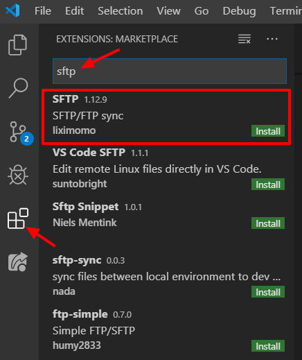

# Editing files with VS Code

#### Download VS Code and install SFTP extension

1. Download VS Code from [https://code.visualstudio.com/Download](https://code.visualstudio.com/Download)
2. Open VS Code
3. Click on the extensions icon in the left sidebar

   

4. Click Install next to the SFTP \(SFTP/FTP sync\) extension

#### Using SFTP extension

You will need an empty "project" directory before setting up SFTP. Create a new folder on your computer \(e.g. in Documents\). In VS Code, navigate to File-&gt; Open Folder and select the new project folder.

Press the Ctrl+Shift+P if you are on Windows/Linux or Cmd+Shift+P on Mac which opens a command palette. Type SFTP and select the SFTP:config option.

This will open the sftp.json file. Edit to match below \(replace username with your username\):

```text
{
    "name": "Charlie",
    "host": "cfe.bigelow.org",
    "protocol": "sftp",
    "port": 22,
    "username": "username",
    "remotePath": "/home/username/",
    "uploadOnSave": true
}
```

Save the file.

Press the Ctrl+Shift+P if you are on Windows/Linux or Cmd+Shift+P on Mac which opens a command palette. Type SFTP and select the SFTP:list option. Select Charlie \(enter your password if prompted.\) 

Select a folder on Charlie that you want to edit files in. VS Code will download a local copy to your machine for offline editing, so be careful to not select a folder with data in it. When you are in the folder that you want to use, click on the ". Choose current folder" at the top of the list.

Repeat the last two steps for multiple folders 

#### More information

[https://artisansweb.net/ftp-sftp-extension-for-visual-studio-code/](https://artisansweb.net/ftp-sftp-extension-for-visual-studio-code/)

